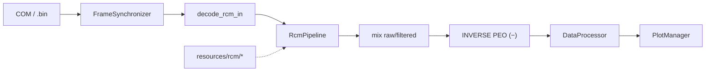

# COM Port Plotter (РКМ / РКМ-С)

GUI-приложение на **Rust + egui** для приёма потока с COM-порта (или офлайн `.bin`),
синхронизации 20-байтных кадров реографа **РКМ / РКМ-С**, DSP-цепочки (как в JavaFX-референсе)
и отображения пяти каналов: **ЭКГ, РЕО-1, BASE-1, РЕО-2, BASE-2**.

| | |
|---|---|
| Крейт | `com-port-plotter` |
| Вендор | RPG |
| Частота | 200 Гц |
| Порт по умолчанию | `38400 7N1`, DTR сброшен, RTS не трогаем |

---

## Содержание

1. [Быстрый старт](#быстрый-старт)
2. [Протокол](#протокол)
3. [Поток данных](#поток-данных)
4. [Структура каталогов](#структура-каталогов)
5. [Модули `src/`](#модули-src)
6. [Где менять масштаб и формулы](#где-менять-масштаб-и-формулы)
7. [Фильтры по каналам](#фильтры-по-каналам)
8. [Ресурсы калибровки](#ресурсы-калибровки)
9. [UI и графики](#ui-и-графики)
10. [Установщик](#установщик)
11. [Тесты](#тесты)

---

## Быстрый старт

```powershell
cd D:\Simple_tokio_app\tokio_app

# Запуск (debug, с консолью)
cargo run

# Release (без консоли)
cargo build --release

# Тесты
cargo test

# Установщик (нужен Inno Setup 6)
.\installer\build-installer.ps1
.\installer\build-installer.ps1 -WithVcRedist -RequireProlific
```

Бинарник: `target\release\com-port-plotter.exe`.

---

## Протокол

### Кадр

- **20 байт** = 10 пар × 2 байта (`FRAME_SIZE` в `src/com_port/sync.rs`).
- В каждом байте значимы биты `6..1` (маска **`0x7E`**). Бит 0 — синхронизация.
- Частота кадров: **200 Гц** (`SAMPLE_RATE_HZ` в `src/data/rcm_pipeline.rs`).

### Синхронизация

`FrameSynchronizer` (`src/com_port/sync.rs`):

- Ищет выравнивание по биту 0 (чередование / «три нулевых bit0»).
- Для **RCMS** дополнительно: последний байт кадра `buffer[19] == 0`.

### Порядок каналов в кадре

Как Java `RcmInVariable` / enum `RcmInChannel`:

| Пара | Байты | Канал | Signed в пайплайне |
|------|-------|--------|--------------------|
| 0 | 0–1 | RHEO_1 (РЕО-1) | да |
| 1 | 2–3 | BASE_1 | нет |
| 2 | 4–5 | RHEO_2 (РЕО-2) | да |
| 3 | 6–7 | ECG (ЭКГ) | да |
| 4 | 8–9 | BASE_2 | нет |
| 5 | 10–11 | RHEO_1X | — |
| 6 | 12–13 | QS_1 | нет |
| 7 | 14–15 | RHEO_2X | — |
| 8 | 16–17 | ECG_X | — |
| 9 | 18–19 | QS_2 (+ у RCMS = 0) | нет |

На графиках показываются пять каналов: ЭКГ, РЕО-1, BASE-1, РЕО-2, BASE-2.

### COM

`SerialConfig::rcm_7n1` в `src/com_port/serial.rs`:

- 38400 бод, 7 бит данных, без чётности, 1 стоп;
- `clearDTR`;
- RTS **не** меняем.

Автопоиск: `src/com_port/discover.rs` — короткий проба-тест портов (~350 мс).

---

## Поток данных

### Live (COM)

```text
COM bytes
  → SerialConfig::open
  → FrameSynchronizer::push_bytes          (live_worker)
  → RcmPipeline::process_raw(&[u8; 20])
       decode_rcm_in                       (10 ADC, без INVERSE)
       FilterBuilder-цепочки по флагам
       mix(filtered, raw) по ChannelFilterFlags
  → to_point()                             (INVERSE: −rheo1/−rheo2)
  → mpsc Batch → MainWindow
  → DataProcessor::push_live_point
  → PlotManager::show_plots
```

Фоновый поток: `src/data/live_worker.rs` (`LiveWorker`).  
UI: `src/ui/main_window.rs`.

### Offline (`.bin`)

```text
Файл SerialService dump
  → load_bin_file / decode_bin_bytes       (bin_playback)
  → FrameSynchronizer (+ flush)
  → RcmPipeline с текущими ChannelFilterFlags
  → out_to_point()                         (тот же INVERSE на РЕО)
  → apply_bin_result → графики
  → PlotManager::enter_offline_view        (зум рамкой, pan, Fit)
```

Профиль по имени файла: `*rcms*` → `RcmProfile::Rcms`, иначе `Rcm`
(`guess_profile_from_path`).

### Диаграмма



---

## Структура каталогов

```text
tokio_app/
├── src/
│   ├── main.rs                 # Точка входа GUI, иконка, светлая тема
│   ├── lib.rs                  # Библиотечный корень
│   ├── com_port/               # COM, sync, decode
│   ├── data/                   # DSP, live, .bin, буферы UI
│   │   └── filter/             # FilterBuilder + примитивы
│   └── ui/                     # egui: окно + графики
├── resources/rcm/              # rcm.json + BR_F*.txt (встраиваются в бинарь)
├── assets/                     # rheogram.ico / .png
├── tests/                      # интеграционные тесты + fixtures/*.bin
├── installer/                  # Inno Setup + build-installer.ps1
├── build.rs                    # winres: иконка .exe, метаданные RPG
└── Cargo.toml
```

---

## Модули `src/`

### `com_port/` — транспорт и разбор кадра

| Файл | Назначение | Ключевые символы |
|------|------------|------------------|
| `serial.rs` | Открытие порта 7N1 | `SerialConfig::rcm_7n1`, `open` |
| `sync.rs` | Блокировка на 20-байтные кадры | `FrameSynchronizer`, `push_bytes`, `flush` |
| `decode.rs` | Пары байт → int / `Frame` | `to_int`, `to_signed_int`, `convert`, `decode_frame` |
| `model.rs` | Модель кадра | `Frame` / `DataPacket`, `ChannelType` |
| `reader.rs` | Чтение с порта (вспомог.) | `ComPortReader`, `decode_dump` |
| `discover.rs` | Автопоиск прибора | `find_rcm_port`, `probe_port`, `list_port_names` |

### `data/` — DSP и буферы

| Файл | Назначение | Ключевые символы |
|------|------------|------------------|
| `rcm_pipeline.rs` | Пайплайн In→Out | `RcmPipeline`, `ChannelFilterFlags`, `decode_rcm_in`, `make_*_filter` |
| `calib.rs` | Калибровка / FIR из resources | `RcmCalibration::load_embedded`, `Curve1d`, `Surface2d` |
| `live_worker.rs` | Фоновый COM→DSP→UI | `LiveWorker`, `LivePoint`, `to_point` |
| `bin_playback.rs` | Офлайн `.bin` | `load_bin_file`, `decode_bin_bytes`, `out_to_point` |
| `processor.rs` | Кольцевые буферы графиков, CSV | `DataProcessor`, `push_live_point`, `save_to_csv` |
| `filter/mod.rs` | Фасад + децимация для графика | `push_one`, `sharping_decimate` |
| `filter/builder.rs` | Цепочки фильтров | `FilterBuilder` |
| `filter/primitives.rs` | FIR, impulsive, RRS, … | `DigitalFilter`, `SmoothingImpulsive`, … |

### `ui/`

| Файл | Назначение | Ключевые символы |
|------|------------|------------------|
| `main_window.rs` | Главное окно: COM, фильтры, `.bin`, запись | `MainWindow`, `start_live`, `open_bin_dialog`, пресеты фильтров |
| `plots.rs` | Отрисовка каналов, зум, ось времени | `PlotManager`, `TimeScale`, `YBounds` |

---

## Где менять масштаб и формулы

Ниже — **практические точки правки**. После изменений в `resources/` или формулах нужен **rebuild**.

### 1. Поделить / умножить значение канала перед графиком (самый простой крючок)

**Live и offline** сходятся в преобразовании `RcmOutSample` → `LivePoint`:

| Файл | Функция | Что править |
|------|---------|-------------|
| `src/data/live_worker.rs` | `to_point` | `rheo1`, `base1`, `ecg`, … |
| `src/data/bin_playback.rs` | `out_to_point` | то же |
| `src/data/processor.rs` | `push_filtered_at` | то же (если кадры идут через UI-процессор) |

Пример — показать РЕО в мОм вместо µΩ (÷1000) и убрать инверсию:

```rust
// src/data/live_worker.rs — fn to_point
rheo1: (s.rheo1 as f64) / 1000.0,   // было: -(s.rheo1 as f64)
rheo2: (s.rheo2 as f64) / 1000.0,
base1: (s.base1 as f64) / 1000.0,   // если base тоже нужно в Ом
ecg: s.ecg as f64,
```

Аналогично поправьте `out_to_point` в `bin_playback.rs`, иначе offline и live разъедутся.

### 2. Инверсия РЕО (Java `Option.INVERSE`)

Сейчас:

```rust
rheo1: -(s.rheo1 as f64),
rheo2: -(s.rheo2 as f64),
```

в `to_point` / `out_to_point` / `push_filtered_at`.  
ЭКГ на этих путях **не** инвертируется.

Пайплайн `decode_rcm_in` инверсию **не** делает — только знаковый expand ADC.

### 3. Формула РЕО (ADC → µΩ)

`src/data/rcm_pipeline.rs` → `make_rheo_filter`:

```rust
((260.0 * 1000.0 * rheo_adc as f64) / denom as f64).round() as i32
```

- `260.0` — опорное сопротивление (Ом) калибровки;
- `1000.0` — перевод в **микроомы**;
- `denom` — интерполяция `rheo_adc_to_260` из `rcm.json` по току QS (CC).

Чтобы получить миллиомы на выходе фильтра: замените `1000.0` на `1.0` или делите в `to_point`.

### 4. BASE (поверхность → mΩ) и QS (→ Ω)

| Функция | Файл | Суть |
|---------|------|------|
| `make_base_filter` | `rcm_pipeline.rs` | `surface.interp(cc, base_adc)` + FIR BR_F* + impulsive(4) |
| `make_qs_filter` | `rcm_pipeline.rs` | `cc_adc_to_ohm.interp_i32(adc)` + impulsive(4) |
| `Surface2d::interp` / `Curve1d` | `calib.rs` | таблицы из JSON |

### 5. Сырой ADC (без Ohm)

| Функция | Файл |
|---------|------|
| `to_int` / `to_signed_int` / `convert` | `com_port/decode.rs` |
| `decode_rcm_in` | `rcm_pipeline.rs` |
| `decode_frame` | `decode.rs` — для простого пути без пайплайна; bipolar уже с минусом |

Маска битов: `0x7E` в `to_int`.

### 6. Калибровочные таблицы

| Файл | Что внутри |
|------|------------|
| `resources/rcm/rcm.json` | кривые CC↔Ohm, BASE surface, Rheo@0.26Ω |
| `resources/rcm/BR_F200.txt` | 22 коэфф. FIR (×8) |
| `resources/rcm/BR_F025.txt` | 25 коэфф. (×5) |
| `resources/rcm/BR_F005.txt` | 10 коэфф. |

Загрузка: `RcmCalibration::load_embedded()` (`include_str!`) — правки требуют пересборки.

Вспомогательное: `milli_suffix_to_ohm` в `calib.rs` (`suffix / 1000.0`).

### 7. Ось времени и Y на графике

| Место | Файл | Заметка |
|-------|------|---------|
| `SAMPLE_RATE_HZ = 200.0` | `rcm_pipeline.rs` | `t = index / 200` |
| `TimeScale` 2/5/10/30 с | `plots.rs` | live-окно |
| `YBounds::from_points` | `plots.rs` | авто-Y + pad 15% |
| `sharping_decimate` | `filter/mod.rs` | только отрисовка, не DSP |
| Подпись оси X | `format_time_axis` в `plots.rs` | секунды (`с`) |

### 8. Единицы в CSV

`DataProcessor::save_to_csv` — заголовки:

`rheo1_uOhm`, `base1_mOhm`, `ecg_mV`, `base2_mOhm`, `rheo2_uOhm`, `qs1_Ohm`, `qs2_Ohm`.

Если меняете масштаб в `to_point`, обновите и имена колонок.

---

## Фильтры по каналам

Структура `ChannelFilterFlags` (`rcm_pipeline.rs`):

```rust
rheo1, base1, ecg, rheo2, base2: bool
```

- **Вкл.** — DSP (Ohm/FIR/smoothing для соответствующего канала).
- **Выкл.** — сырой ADC из буфера, выровненный по задержке BASE FIR (~1.7 с), если хоть один фильтр включён.
- Все выкл. — выдача 1:1 без прогрева FIR.

По умолчанию: ЭКГ + BASE-1 + BASE-2 **вкл.**, РЕО **выкл.**

В UI — чекбоксы в панели профиля. Для каждого `.bin` набор сохраняется в:

`%APPDATA%\com-port-plotter\channel_filters.json`

(см. `filter_presets_path` в `main_window.rs`).

RCMS: `QS_2` копируется из `QS_1` в пайплайне.

---

## Ресурсы калибровки

```text
resources/rcm/
  rcm.json       # калибровки электродов / рео / base
  BR_F200.txt    # FIR bank
  BR_F025.txt
  BR_F005.txt
```

Иконки приложения:

```text
assets/rheogram-icon.png   # окно (egui)
assets/rheogram.ico        # .exe + Inno Setup
```

---

## UI и графики

`PlotManager` (`plots.rs`):

- Live: скользящее окно `TimeScale` (прилипает к концу потока).
- Offline (`.bin`): свободная навигация — ЛКМ зум по времени, ПКМ/СКМ pan, Fit / двойной клик, ±.
- Линии чёрные, тема светлая, ось X в секундах от начала записи (`t, с`).

Порядок графиков на экране: ЭКГ → РЕО-1 → BASE-1 → РЕО-2 → BASE-2.

---

## Установщик

```text
installer/
  build-installer.ps1          # сборка release + ISCC
  com-port-plotter.iss         # Inno Setup (вендор RPG)
  drivers/prolific/            # положить PL23XX_Prolific_DriverInstaller.exe
  output/                      # COMPortPlotter-Setup-*.exe
```

Тихая установка Prolific: `PL23XX_…exe /s` (галочка в мастере).  
Опционально VC++: `-WithVcRedist`.

Скачать драйвер:  
https://www.prolific.com.tw/US/ShowProduct.aspx?p_id=225&pcid=41

---

## Тесты

```powershell
cargo test                 # unit + integration
cargo test --lib           # только lib
cargo test --test rcm_fixture
```

Фикстуры: `tests/fixtures/*.bin` (дампы SerialService).

---

## Частые сценарии правки

| Задача | Куда идти |
|--------|-----------|
| Поделить РЕО на 1000 на графике | `to_point` + `out_to_point` |
| Убрать инверсию РЕО | убрать `-` в тех же функциях |
| Изменить Ohm-формулу РЕО | `make_rheo_filter` (`260.0 * 1000.0 * …`) |
| Подкрутить BASE FIR | `BR_F*.txt` + `make_base_filter` |
| Сменить калибровку прибора | `resources/rcm/rcm.json` |
| Всегда фильтровать РЕО | UI-чекбокс или `ChannelFilterFlags::default` |
| Сменить частоту дискретизации в UI | `SAMPLE_RATE_HZ` (и убедиться, что прибор тот же) |
| Скорость COM | `MainWindow::baud_rate` / `SerialConfig` |

---

## Ссылки на референс

Поведение DSP и протокола сверено с JavaFX-проектом (SerialService → interceptor → `RcmConverter` → Out filters / `sharpingDecimate`).
